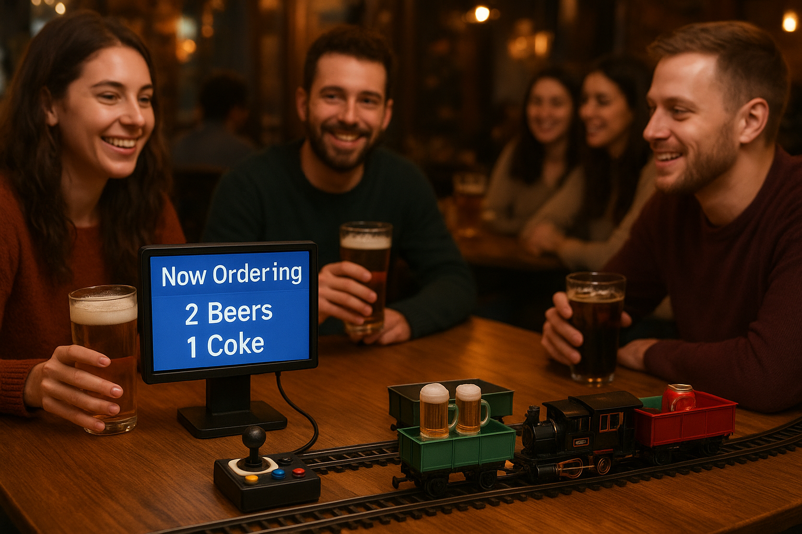

# 🍻 SmartCheers – Projet IoT

**SmartCheers** est un projet IoT développé dans un cadre académique visant à améliorer le service de boissons dans les bars très fréquentés, notamment lors de soirées étudiantes.

Le projet propose une **table connectée intelligente** permettant aux clients de commander leurs boissons sans attendre un serveur, tout en offrant une gestion centralisée et en temps réel côté bar.

## 💡 Concept

Chaque table est équipée d’un **Raspberry Pi** connecté à des capteurs IoT (bouton interactif, LEDs, capteur de présence, lecteur RFID/NFC).  
Les commandes sont envoyées via **MQTT** à un serveur central, puis affichées sur une **interface web** utilisée par les serveurs.

Un retour visuel informe le client de l’état de sa commande :
- 🟢 En préparation
- 🔵 Prête à servir
- 🔴 Erreur

## ⚙️ Architecture

- Raspberry Pi comme nœud IoT par table
- Communication temps réel via **MQTT**
- Broker **Mosquitto** sur VM Ubuntu
- Serveur applicatif + interface web
- Synchronisation possible avec un cloud public (statistiques & supervision)

## 🎯 Objectifs

- Fluidifier le service en période de forte affluence
- Réduire les erreurs de communication
- Améliorer l’expérience client et serveur
- Mettre en œuvre une architecture IoT réaliste et complète

## 🚀 Perspectives

Le système peut évoluer vers des expériences originales, comme la **livraison automatisée de boissons via un train miniature**, pour renforcer l’aspect immersif et innovant.

## 👤 Auteur

**Clément Lemlijn**  
Projet académique – 2025-2026
