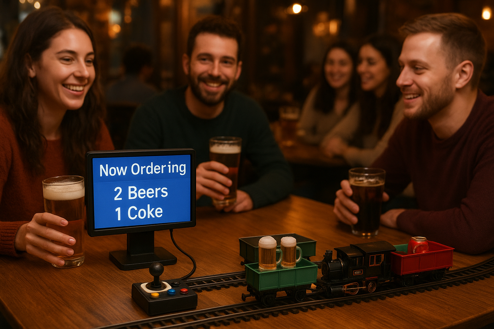

# 🍻 SmartCheers – Projet IoT
Une table connectée qui fluidifie le service dans les bars à forte affluence.

**SmartCheers** est un projet IoT développé dans un cadre académique visant à améliorer le service de boissons dans les bars très fréquentés, notamment lors de soirées étudiantes.

Le projet propose une **table connectée intelligente** permettant aux clients de commander leurs boissons sans attendre un serveur, tout en offrant une gestion centralisée et en temps réel côté bar.

## 🎯 Problématique

Lors des périodes de forte affluence (soirées étudiantes, festivals, événements), les clients peuvent devoir attendre longtemps avant qu'un serveur puisse prendre leur commande. Cette attente génère de la frustration, augmente le risque d'erreurs de communication et réduit l'efficacité du service.

## 💡 Concept

Chaque table est équipée d’un **Raspberry Pi** connecté à des capteurs IoT (bouton interactif, LEDs, capteur de présence, lecteur RFID/NFC).  
Les commandes sont envoyées via **MQTT** à un serveur central, puis affichées sur une **interface web** utilisée par les serveurs.

Un retour visuel informe le client de l’état de sa commande :
- 🟢 En préparation
- 🔵 Prête à servir
- 🔴 Erreur

## 🏢 Domaine d'application

SmartCheers s'adresse au secteur Horeca, plus particulièrement aux bars, cafés, établissements étudiants et événements proposant un service à table.

## 👥 Utilisateurs

Le système est destiné à plusieurs catégories d'utilisateurs :

- les clients qui commandent leurs boissons ;
- les serveurs qui préparent et livrent les commandes ;
- les responsables d'établissement qui supervisent le service.

## ⚙️ Architecture

- Raspberry Pi comme nœud IoT par table
- Communication temps réel via **MQTT**
- Broker **Mosquitto** sur VM Ubuntu
- Serveur applicatif + interface web
- Synchronisation possible avec un cloud public (statistiques & supervision)

## 📝 Scénario d'utilisation

1. Le client s'installe à une table SmartCheers.
2. Il passe une commande via l'interface de la table.
3. La commande est transmise au serveur via MQTT.
4. Le personnel du bar visualise immédiatement la nouvelle commande.
5. Le client est informé de l'avancement de sa commande grâce aux indicateurs de la table.

## 🎯 Objectifs

- Fluidifier le service en période de forte affluence
- Réduire les erreurs de communication
- Améliorer l’expérience client et serveur
- Mettre en œuvre une architecture IoT réaliste et complète

## 🏢 Startup SmartCheers

SmartCheers est imaginé comme une solution commercialisée auprès de plusieurs établissements indépendants.

Chaque client dispose de ses propres tables connectées tandis que la startup assure la maintenance, les mises à jour logicielles, la supervision des installations et l'analyse des statistiques d'utilisation.

## 👤 Auteur

**Clément Lemlijn**  
Projet académique – 2025-2026
