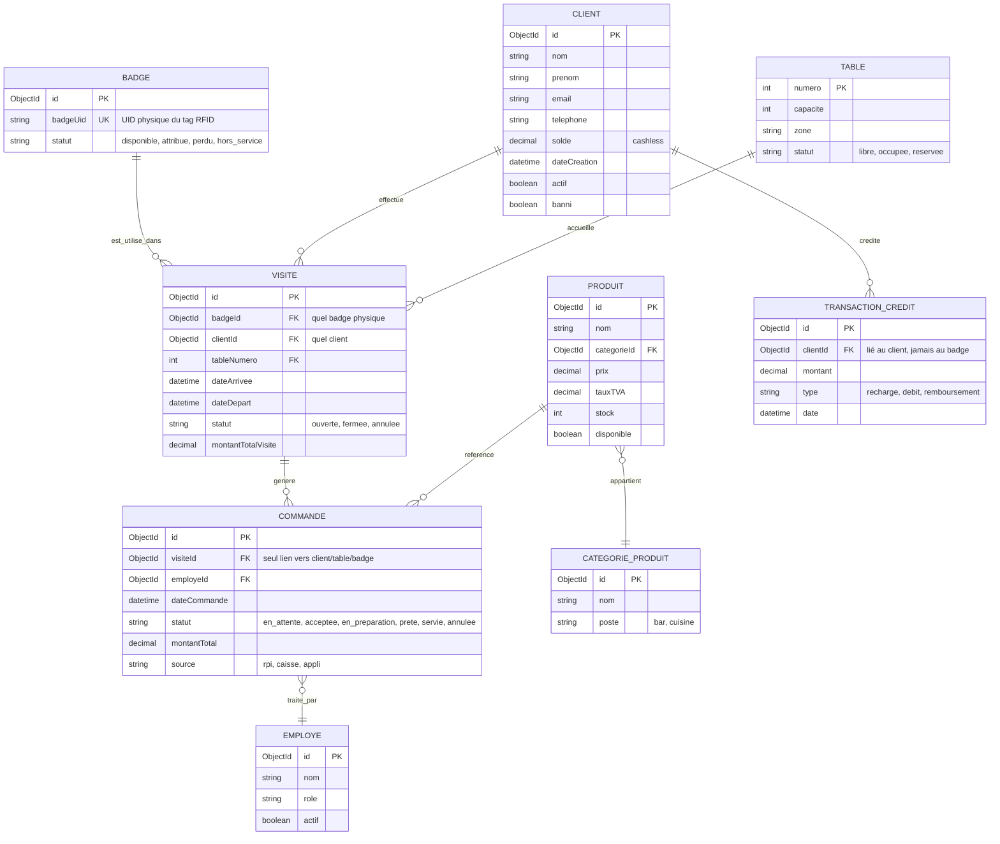

```mermaid
erDiagram
    BADGE ||--o{ VISITE : est_utilise_dans
    CLIENT ||--o{ VISITE : effectue
    TABLE ||--o{ VISITE : accueille
    VISITE ||--o{ COMMANDE : genere
    PRODUIT ||--o{ COMMANDE : reference
    COMMANDE }o--|| EMPLOYE : traite_par
    CLIENT ||--o{ TRANSACTION_CREDIT : credite
    PRODUIT }o--|| CATEGORIE_PRODUIT : appartient

    BADGE {
        ObjectId id PK
        string badgeUid UK "UID physique du tag RFID"
        string statut "disponible, attribue, perdu, hors_service"
    }

    CLIENT {
        ObjectId id PK
        string nom
        string prenom
        string email
        string telephone
        decimal solde "cashless"
        datetime dateCreation
        boolean actif
        boolean banni
    }

    TABLE {
        int numero PK
        int capacite
        string zone
        string statut "libre, occupee, reservee"
    }

    VISITE {
        ObjectId id PK
        ObjectId badgeId FK "quel badge physique"
        ObjectId clientId FK "quel client"
        int tableNumero FK
        datetime dateArrivee
        datetime dateDepart
        string statut "ouverte, fermee, annulee"
        decimal montantTotalVisite
    }

    COMMANDE {
        ObjectId id PK
        ObjectId visiteId FK "seul lien vers client/table/badge"
        ObjectId employeId FK
        datetime dateCommande
        string statut "en_attente, acceptee, en_preparation, prete, servie, annulee"
        decimal montantTotal
        string source "rpi, caisse, appli"
    }

    PRODUIT {
        ObjectId id PK
        string nom
        ObjectId categorieId FK
        decimal prix
        decimal tauxTVA
        int stock
        boolean disponible
    }

    CATEGORIE_PRODUIT {
        ObjectId id PK
        string nom
        string poste "bar, cuisine"
    }

    EMPLOYE {
        ObjectId id PK
        string nom
        string role
        boolean actif
    }

    TRANSACTION_CREDIT {
        ObjectId id PK
        ObjectId clientId FK "lié au client, jamais au badge"
        decimal montant
        string type "recharge, debit, remboursement"
        datetime date
    }
```
