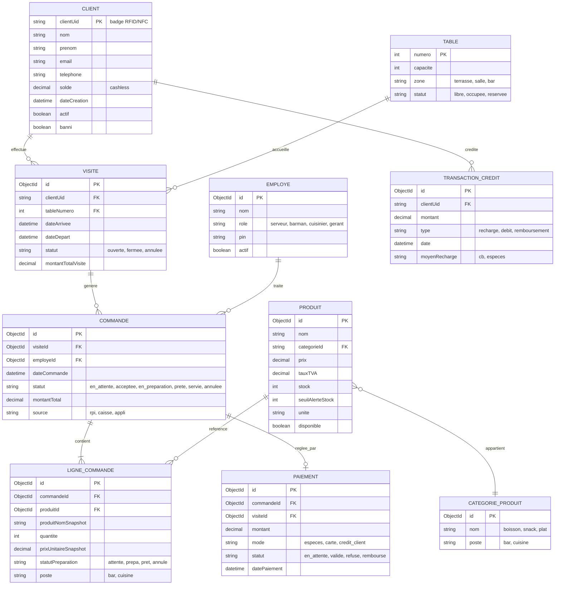

```mermaid
erDiagram
    CLIENT ||--o{ VISITE : effectue
    TABLE ||--o{ VISITE : accueille
    VISITE ||--o{ COMMANDE : genere
    COMMANDE ||--|{ LIGNE_COMMANDE : contient
    PRODUIT ||--o{ LIGNE_COMMANDE : reference
    COMMANDE ||--o| PAIEMENT : reglee_par
    EMPLOYE ||--o{ COMMANDE : traite
    CLIENT ||--o{ TRANSACTION_CREDIT : credite
    PRODUIT }o--|| CATEGORIE_PRODUIT : appartient

    CLIENT {
        string clientUid PK "badge RFID/NFC"
        string nom
        string prenom
        string email
        string telephone
        decimal solde "cashless"
        datetime dateCreation
        boolean actif
        boolean banni
    }

    TABLE {
        int numero PK
        int capacite
        string zone "terrasse, salle, bar"
        string statut "libre, occupee, reservee"
    }

    VISITE {
        ObjectId id PK
        string clientUid FK
        int tableNumero FK
        datetime dateArrivee
        datetime dateDepart
        string statut "ouverte, fermee, annulee"
        decimal montantTotalVisite
    }

    COMMANDE {
        ObjectId id PK
        ObjectId visiteId FK
        ObjectId employeId FK
        datetime dateCommande
        string statut "en_attente, acceptee, en_preparation, prete, servie, annulee"
        decimal montantTotal
        string source "rpi, caisse, appli"
    }

    LIGNE_COMMANDE {
        ObjectId id PK
        ObjectId commandeId FK
        ObjectId produitId FK
        string produitNomSnapshot
        int quantite
        decimal prixUnitaireSnapshot
        string statutPreparation "attente, prepa, pret, annule"
        string poste "bar, cuisine"
    }

    PRODUIT {
        ObjectId id PK
        string nom
        string categorieId FK
        decimal prix
        decimal tauxTVA
        int stock
        int seuilAlerteStock
        string unite
        boolean disponible
    }

    CATEGORIE_PRODUIT {
        ObjectId id PK
        string nom "boisson, snack, plat"
        string poste "bar, cuisine"
    }

    PAIEMENT {
        ObjectId id PK
        ObjectId commandeId FK
        ObjectId visiteId FK
        decimal montant
        string mode "especes, carte, credit_client"
        string statut "en_attente, valide, refuse, rembourse"
        datetime datePaiement
    }

    EMPLOYE {
        ObjectId id PK
        string nom
        string role "serveur, barman, cuisinier, gerant"
        string pin
        boolean actif
    }

    TRANSACTION_CREDIT {
        ObjectId id PK
        string clientUid FK
        decimal montant
        string type "recharge, debit, remboursement"
        datetime date
        string moyenRecharge "cb, especes"
    }
```
