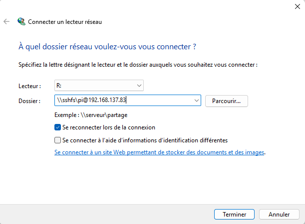

# Pour pouvoir accéder au Rpi en "remote development"

- **IntelliJ IDEA Ultimate** : `File` -> `Remote Development`
- **VSCode** : `Extensions` -> `Remote - SSH` (by Microsoft)

Ne fonctionnent pas car Rpi tourne sous **Raspbian 10 (Buster)** en **ARMv7(32bits)**.

Une solution quick & dirty est donc de monter le dossier du Pi avec [WinFsp](https://winfsp.dev/) ainsi que [SSHFS-Win](https://github.com/winfsp/sshfs-win).

  
  

