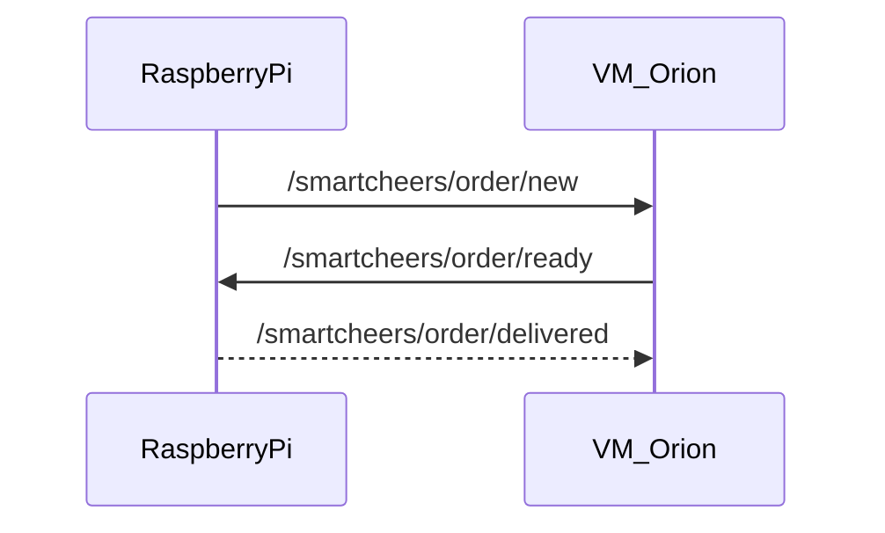

# 🍻 SmartCheers – MQTT Broker


## Start : 
```
sudo docker compose restart
```

## Service check : 
```
cd MASI4-IoT-Smartcheers/vm2-orion/mqtt-broker/
sudo docker compose ps
netstat -tulpn | grep 1883
sudo docker exec -it mosquitto mosquitto_sub -t '$SYS/#' -C 1 -u clement-lemlijn -P mqtt-pwd
```

## add user : 
```
sudo docker exec -it mosquitto mosquitto_passwd -c /mosquitto/config/pwfile ton_user
```

--- 

## Use : 
### Sub
```
sudo docker exec -it mosquitto mosquitto_sub -t "smartcheers/order/create" -u clement-lemlijn -P mqtt-pwd
sudo docker exec -it mosquitto mosquitto_sub -t "smartcheers/orders/new" -u clement-lemlijn -P mqtt-pwd
```
### Pub 
```
sudo docker exec -it mosquitto mosquitto_pub -t "test" -m "Test de connexion" -u clement-lemlijn -P mqtt-pwd
```

### QoS 2 : 
```
sudo docker exec -it mosquitto mosquitto_sub -t "test/qos2" -q 2 -u clement-lemlijn -P mqtt-pwd -v
sudo docker exec -it mosquitto mosquitto_pub -t "test/qos2" -m "Message QoS 2 garanti" -q 2 -u clement-lemlijn -P mqtt-pwd
```
La preuve technique :
- Capture Wireshark sur ta machine (ou tcpdump sur la VM).
- Filtre par mqtt.
- 4 paquets caractéristiques de la transaction QoS 2 :
  - PUBLISH (le message part)
  - PUBREC (le broker dit "j'ai reçu")
  - PUBREL (le client dit "je confirme la réception")
  - PUBCOMP (le broker dit "transaction terminée")
Si cette séquence apparaît, "QoS 2" valide


## MQTT channels 



### Acccess rights 

```
sudo chown -R 1883:1883 ./config/certs

sudo chmod 755 ./config/certs
sudo chmod 644 ./config/certs/certs/ca.crt
sudo chmod 644 ./config/certs/server.crt
sudo chmod 600 ./config/certs/server.key
```
